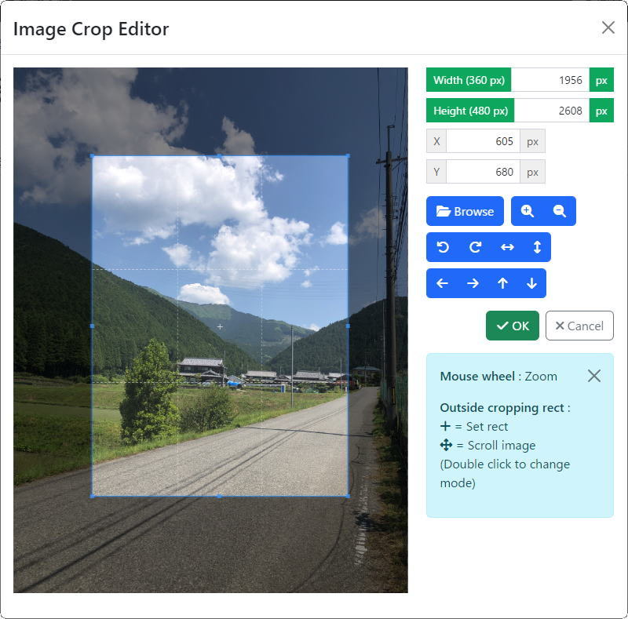

# yii2-cropper-bs5
Yii2 Image Cropper Input Widget for bootstrap 5



Features
--------
This is a wrapper of <a href="https://fengyuanchen.github.io/cropperjs/" target="_blank">fengyuanchen/Cropper.js</a>.
It provides the following feature:

+ Crop
+ Image Rotate
+ Image Flip
+ Image Zoom
+ Coordinates
+ Image Sizes Info
+ Base64 Data
+ Set Image.Url Directly 
+ Set Image.Src With Javascript

Difference from bilginnet/yii2-cropper
--------------------------------------

This is a fork of [bilginnet/yii2-cropper](https://github.com/bilginnet/yii2-cropper),
but it has some important difference:

+ Works with bootstrap 5
+ Improved UI design of the modal
+ Supports the latest version of Cropper.js through composer
+ Backward incompatibility
  + Doesn't work with bootstrap 3
  + Some incompatibility in the options

Installation
------------

The preferred way to install this extension is through [composer](http://getcomposer.org/download/).

Either run

```
php composer.phar require --prefer-dist softark/yii2-cropper-bs5 "dev-master"
```

or add

```
"softark/yii2-cropper-bs5": "dev-master"
```

to the require section of your `composer.json` file.


Usage
-----

### 1) Add aliases for image directory

Add aliases for the directory to store the images in your config file.

```php
       $baseUrl = str_replace('/web', '', (new Request)->getBaseUrl());

       Yii::setAlias('@imagesUrl', $baseUrl . '/images/');
       Yii::setAlias('@imagesPath', realpath(dirname(__FILE__) . '/../images/'));
       // image file will be stored in //root/images folder
       
       return [
           ....
       ]
```

### 2) Extend model to handle image data from cropper

Add a virtual attribute for the image data from the cropper widget in your model.

```php
    public $_image

    public function rules()
    {
        return [
            ['_image', 'safe'],
        ];
    }
```

And write a function to save the image data from the cropper widget to a file.

```php
    public function beforeSave($insert)
    {
        if (is_string($this->_image) && strstr($this->_image, 'data:image')) {

            // creating image file as png, for example
            // cropper sends image data in a base64 encoded string
            $data = $this->_image;
            $data = base64_decode(preg_replace('#^data:image/\w+;base64,#i', '', $data));
            $fileName = time() . '-' . rand(100000, 999999) . '.png';
            file_put_contents(Yii::getAlias('@imagesPath') . '/' . $fileName, $data);

            // deleting old image file if any
            // $this->filename is the real attribute for the filename
            // customize your code for your attribute
            if (!$this->isNewRecord && !empty($this->filename)) {
                @unlink(Yii::getAlias('@imagesPath') . '/' . $this->filename);
            }
            
            // set new filename
            $this->filename = $fileName;
        }

        return parent::beforeSave($insert);
    }
```

### 3) Place cropper in _form file

The following is a typical code that appears in _form file:

```php
echo $form->field($model, '_image')->widget(\softark\cropper\Cropper::class, [

    // Unique ID of the cropper. Will be set automatically if not set.
    'uniqueId' => 'image_cropper',

    // The url of the initial image.
    // You can set the current image url for update scenario, and
    // set null for create scenario.
    // Defaults to null.
    'imageUrl' => ($model->isNewRecord) ? null : Yii::getAlias('@imagesUrl') . $model->filename,
    
    // Cropper options
    'cropperOptions' => [
        // The dimensions of the image to be cropped and saved.
        // You have to specify both width and height.
        'width' => 1200,
        'height' => 800,

        // Preview window options
        'preview' => [
            // The dimensions of the preview image must be specified.
            'width' => 600, // you can set as string '100%'
            'height' => 400, // you can set as string '100px'
            // The url of the initial image for the preview.
            'url' => (!empty($model->filename)) ? Yii::getAlias('@imagesUrl' . '/' . $model->filename) : null,
        ],

        // Whether to use FontAwesome icons
        'useFontAwesome' => true, // default = false : use Unicode Chars
    ],
    
    // Modal options
    'modalOptions' => [
        // Specify the size of the modal.
        // 'modal-md', 'modal-lg', or 'modal-xl'
        // Default and recommended value is 'modal-lg'
        'modalClass' => 'modal-lg',
    ],
 ]);
```

While much more options are supported for the widget,
usually you can safely ignore them to accept the default values.

### 4) Options in detail

----
#### uniqueId
| name     | type   | required  | default value |
|----------|--------|-----------|---------------|
| uniqueId | string | no        | (empty)       |

Unique Id of the cropper widget. It will be created automatically if it is empty.

These elements will have unique Ids by appending it.

* buttonId          = #cropper-select-button-$uniqueId
* previewId         = #cropper-result-$uniqueId
* modalId           = #cropper-modal-$uniqueId
* imageId           = #cropper-image-$uniqueId
* inputChangeUrlId  = #cropper-url-change-input-$uniqueId
* cropButtonId      = #crop-button-$uniqueId
* inputId           = #cropper-input-$uniqueId

----
#### imageUrl
| name     | type   | required | default value |
|----------|--------|----------|---------------|
| imageUrl | string | no       | (empty)       |

The url of the source image file to crop.

When you want to crop an existing image in `update` scenario, you can set this property.
Otherwise you can safely ignore it.

----
#### cropperOptions
| name           | type  | required | default value |
|----------------|-------|----------|---------------|
| cropperOptions | array |          |               |

The cropper option array in `key => value` format. Some of them are mandatory.

| name                     | type | required | default value |
|--------------------------|------|----------|---------------|
| cropperOptions['width']  | int  | yes      |               |
| cropperOptions['height'] | int  | yes      |               |

The dimensions of the image to be saved as the result of cropping. Both width and height are required.

| name                             | type   | required | default value     |
|----------------------------------|--------|----------|-------------------|
| cropperOptions['buttonCssClass'] | string | no       | 'btn btn-primary' |

The css class of the buttons.

| name                      | type               | required | default value |
|---------------------------|--------------------|----------|---------------|
| cropperOptions['preview'] | false &#124; array | no       | false         |

The options for the preview image. The preview image won't be displayed if it is false.

| name                                | type              | required | default value |
|-------------------------------------|-------------------|----------|---------------|
| cropperOptions['preview']['width']  | int &#124; string | no       | 100           |
| cropperOptions['preview']['height'] | int &#124; string | no       | 100           |

The dimensions of the preview window in pixcels.

Alternatively you can set width and height using string instead of integer. (e.g. "100px", "100%" )

| name                             | type   | required | default value |
|----------------------------------|--------|----------|---------------|
| cropperOptions['preview']['url'] | string | no       | (empty)       |

The source of the initial image displayed in the preview window.

Like `imageUrl` option, you may want to set this property in `update` scenario.
Otherwise you can safely set it tu empty.

| name                             | type | required | default value |
|----------------------------------|------|----------|---------------|
| cropperOptions['useFontAwesome'] | bool | no       | false         |

Whether to use `FontAwesome` icons or not. It is false by default, and unicode symbol characters will be used.

The following table shows the definitions of the icons. You may override any one of them.

| name                                         | Unicode | FontAwesome                                             |
|----------------------------------------------|---------|---------------------------------------------------------|
| cropperOptions['icons']['browse']            | 🗁      | `<i class="fa-solid fa-folder-open"></i>`               |
| cropperOptions['icons']['ok']                | ✔       | `<i class="fa-solid fa-check"></i>`                     |
| cropperOptions['icons']['cancel']            | 🗙      | `<i class="fa-solid fa-xmark"></i>`                     |
| cropperOptions['icons']['zoom-in']           | 🔍+     | `<i class="fa-solid fa-magnifying-glass-plus"></i>`     |
| cropperOptions['icons']['zoom-out']          | 🔍-     | `<i class="fa-solid fa-magnifying-glass-minus"></i>`    |
| cropperOptions['icons']['rotate-left']       | ⭯       | `<i class="fa-solid fa-arrow-rotate-left"></i>`         |
| cropperOptions['icons']['rotate-right']      | ⭮       | `<i class="fa-solid fa-arrow-rotate-right"></i>`        |
| cropperOptions['icons']['flip-horizontal']   | 🡘      | `<i class="fa-solid fa-arrows-h"></i>`                  |
| cropperOptions['icons']['flip-vertical']     | 🡙      | `<i class="fa-solid fa-arrows-v"></i>`                  |
| cropperOptions['icons']['move-left']         | 🡐      | `<i class="fa-solid fa-arrow-left"></i>`                |
| cropperOptions['icons']['move-right']        | 🡒      | `<i class="fa-solid fa-arrow-right"></i>`               |
| cropperOptions['icons']['move-up']           | 🡑      | `<i class="fa-solid fa-arrow-up"></i>`                  |
| cropperOptions['icons']['move-down']         | 🡓      | `<i class="fa-solid fa-arrow-down"></i>`                |
| cropperOptions['icons']['cursor-cross-hair'] | 🞡      | `<i class="fa-solid fa-plus"></i>`                      |
| cropperOptions['icons']['cursor-move']       | ✥       | `<i class="fa-solid fa-arrows-up-down-left-right"></i>` |

----
#### jsOptions
| name      | type  | required | default value |
|-----------|-------|----------|---------------|
| jsOptions | array | no       | (empty)       |

The javascript options associate with the cropper widget.
Currently only `jsOptions['onClik']` is supported.

| name                 | type   | required | default value |
|----------------------|--------|----------|---------------|
| jsOptions['onClick'] | string | no       | (empty)       |

You may set a javascript that will be triggered when `OK` button is clicked.

----
#### label
| name  | type                | required | default value |
|-------|---------------------|----------|---------------|
| label | string &#124; false | no       | (empty)       |

The label of the cropper widget. It defaults to the label of the model's attribute.

Optionally you can set your own text or hide it (by setting false).

----
#### template
| name     | type    | required | default value       |
|----------|---------|----------|---------------------|
| template | string  | no       | '{preview}{button}' |

The template of the cropper widget. It recognizes '{preview}' and '{button}'.

----
#### modalOptions
| name         | type  | required | default value |
|--------------|-------|----------|---------------|
| modalOptions | array | no       | (empty)       |

The options for the modal dialog.

| name                  | type   | required | default value |
|-----------------------|--------|----------|---------------|
| modalOptions['title'] | string | no       | (empty)       |

The title of the modal. It will be set automatically when it is not specified.

| name                       | type   | required | default value |
|----------------------------|--------|----------|---------------|
| modalOptions['modalClass'] | string | no       | 'modal-lg'    |

The CSS class of the modal. You may set 'modal-md', 'modal-lg' or 'modal-xl'. The default value is 'modal-lg', and it is also the recommmended value.

| name                        | type   | required | default value |
|-----------------------------|--------|----------|---------------|
| modalOptions['canvasClass'] | string | no       | 'col-8'       |
| modalOptions['panelClass']  | string | no       | 'col-4'       |

The CSS classes of the canvas and the control panel.

If you want the canvas and the control panel layouted horizontally, the column widths should add up to 12 (e.g. 'col-9' and 'col-3').

If you want them layouted vertically, set 'col-12' to the both of them. 

| name                          | type   | required | default value |
|-------------------------------|--------|----------|---------------|
| modalOptions['sizeDisp']      | bool   | no       | true          |
| modalOptions['sizeDispClass'] | string | no       | 'col-12'      |
| modalOptions['posDisp']       | bool   | no       | true          |
| modalOptions['posDispClass']  | string | no       | 'col-8'       |

The options that control the information display.

Default values are optimized for a horizontally layouted large modal('modal-lg).
You may want to customize them as you like.

| name                          | type   | required | default value |
|-------------------------------|--------|----------|---------------|
| modalOptions['zoomEnabled']   | bool   | no       | true          |
| modalOptions['rotateEnabled'] | bool   | no       | true          |
| modalOptions['flipEnabled']   | bool   | no       | true          |
| modalOptions['scrollEnabled'] | bool   | no       | true          |

The options that control the control button display.

| name                     | type   | required | default value |
|--------------------------|--------|----------|---------------|
| modalOptions['showHelp'] | bool   | no       | true          |

Whether to display the help message.
